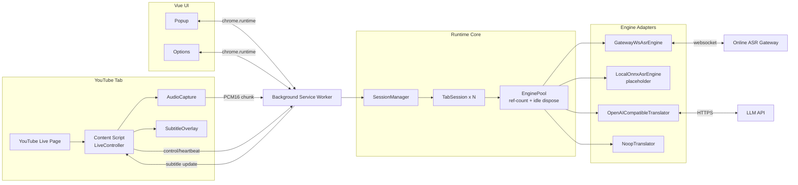

# 架构设计

## 关键工程点

- 会话模型: `tabId:frameId` 唯一会话键，支持多直播并发。
- 生命周期:
  - 页面导航/销毁: `yt-navigate-*`, `beforeunload`, `pagehide` 触发清理。
  - 心跳保护: content 每 5s 心跳，后台超时自动回收。
  - 音频与模型资源: pause/ended 立即停采集；引擎空闲自动卸载。
- 内存防护:
  - 音频队列上限 + 丢包计数，避免慢 ASR 导致内存堆积。
  - `Port` 断开自动销毁会话，防止悬挂引用。

## 可扩展性

新增模型只需要：

1. 在 `src/background/engines/` 增加新引擎类。
2. 在 `engine-registry.ts` 注册 key 与工厂。
3. 在 `settings.ts` 扩展配置 schema。
4. 在 Vue 设置页面暴露配置项。
